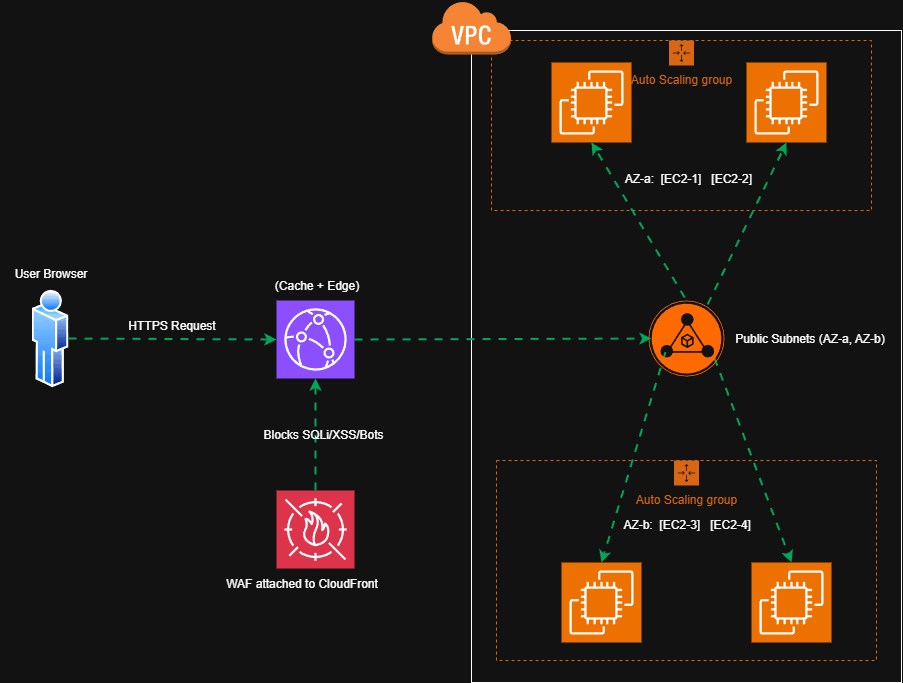

# Deploy Scalable & Secure Web Architecture on AWS


<!-- Replace with your diagram (PNG/GIF). Example: assets/architecture.png -->
[Open the editable draw.io file](test.drawio)
---

## TABLE OF CONTENTS

1. [Goal](#goal)
2. [Architecture Overview](#architecture-overview)
3. [Pre-Requisites](#pre-requisites)
4. [Pre-Deployment](#pre-deployment)
5. [VPC & Application Deployment](#vpc--application-deployment)
6. [Traffic Flow](#traffic-flow)
7. [Validation](#validation)
8. [Author & Community](#author--community)
9. [Support the Project](#-support-the-project)

---

## Goal

Deploy a secure, highly available, and scalable web architecture on AWS using:

- Amazon CloudFront (CDN / Edge)
- AWS WAF (Layer 7 protection)
- Application Load Balancer (ALB)
- Auto Scaling Group (EC2) across 2 Availability Zones
- VPC with public and private subnets

---

## Architecture Overview

High-level design:

- Users access the application over HTTPS.
- CloudFront accelerates delivery and caches content at the edge.
- AWS WAF is attached to CloudFront to block malicious traffic (SQLi/XSS/bots).
- CloudFront forwards cache-miss requests to ALB (as origin).
- ALB distributes traffic to EC2 instances in an Auto Scaling Group across two AZs.
- EC2 returns responses back through ALB → CloudFront → Users.

---

## Pre-Requisites

1. An active AWS account: https://aws.amazon.com/
2. IAM user/role permissions to create:
   - VPC, Subnets, Route Tables, IGW (and optional NAT)
   - EC2, Auto Scaling, ALB, Target Groups, Security Groups
   - CloudFront Distribution, WAF Web ACL
   - ACM certificate (optional, for custom domain HTTPS)
3. Application source code ready to be deployed on EC2 (Apache/Nginx/Node/etc.)

---

## Pre-Deployment

Prepare a Golden AMI (recommended) or bootstrap via User Data:

1. Install dependencies on an EC2 instance:
   - AWS CLI
   - Web server (Apache / Nginx)
   - Git (optional)
   - CloudWatch Agent (optional)
2. Deploy your application to the web root.
3. Ensure the application listens on HTTP port 80.
4. Create an AMI from the configured instance (Golden AMI).

---

## VPC & Application Deployment

### 1) Network Setup

1. Create a VPC (example: `10.0.0.0/16`).
2. Create 2 Public Subnets in 2 AZs (for ALB).
3. Create 2 Private Subnets in 2 AZs (for EC2 instances).
4. Attach an Internet Gateway (IGW) to the VPC.
5. Configure Route Tables:
   - Public subnets route `0.0.0.0/0` → IGW
   - Private subnets route outbound via NAT Gateway (optional, recommended if instances need internet access)
6. (Optional) Create NAT Gateway in a public subnet and associate private route tables to NAT.

### 2) Security Groups

7. Create Security Group for ALB:
   - Inbound: 80/443 from CloudFront (or 0.0.0.0/0 for testing)
   - Outbound: to EC2 instances on port 80
8. Create Security Group for EC2 (ASG instances):
   - Inbound: port 80 ONLY from ALB security group
   - SSH (optional): restrict to Bastion/VPN/your IP (do not open to the world)

### 3) ALB + Auto Scaling

9. Create an Application Load Balancer (ALB) in Public Subnets (multi-AZ).
10. Create a Target Group (HTTP:80) for EC2 targets.
11. Create a Launch Template / Launch Configuration:
    - AMI: Golden AMI
    - Instance type: e.g. `t3.micro`
    - User Data (if needed) to install/start app
    - IAM role (optional): SSM + minimal permissions
12. Create Auto Scaling Group (ASG):
    - Min: 2
    - Max: 4
    - Desired: 2
    - Subnets: both Private Subnets (AZ-a and AZ-b)
13. Attach ASG to Target Group.
14. Create ALB Listener:
    - HTTP:80 → forward to Target Group
    - HTTPS:443 (optional) → forward to Target Group

### 4) CloudFront + WAF

15. Create a CloudFront Distribution:
    - Origin: ALB DNS name
    - Viewer protocol policy: Redirect HTTP to HTTPS
    - Cache behavior: as needed (static vs dynamic)
16. Create AWS WAF Web ACL:
    - Enable AWS Managed Rule Groups (recommended):
      - SQLi protections
      - XSS protections
      - Known bad inputs
      - Bot control (optional)
17. Attach the WAF Web ACL to CloudFront Distribution.
18. (Optional) Domain + HTTPS:
    - Use Route 53 hosted zone
    - Request ACM certificate (in us-east-1 for CloudFront)
    - Attach custom domain to CloudFront

---

## Traffic Flow

```text
(1) HTTPS Request:
User Browser → CloudFront

(2) Cache HIT:
CloudFront → User Browser (response from edge cache)

(3) Cache MISS / Origin fetch:
CloudFront → ALB (origin)

(4) Load balancing:
ALB → EC2 instances (Auto Scaling Group across 2 AZ)

(5) Response:
EC2 → ALB → CloudFront → User
