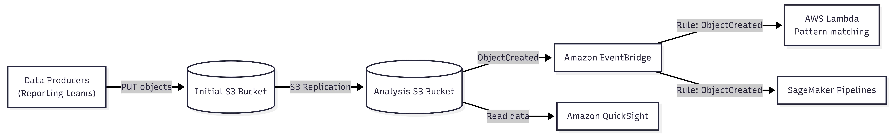

# Automated File Ingestion and Analytics Pipeline  
**S3 Replication + EventBridge + Lambda + SageMaker Pipelines + QuickSight**

---

## 1. Overview

This solution automates the ingestion, processing, and analytics of files uploaded to Amazon S3 with **minimal operational overhead**.

Instead of manually copying files or running custom copy logic, the design relies on **AWS-managed S3 Replication** and **event-driven orchestration** using Amazon EventBridge.

The architecture ensures that:
- Files are automatically copied as they arrive
- Processing is triggered immediately after data is ready
- Analytics tools can consume data without manual intervention

---

## 2. Business Problem

- Multiple teams upload files daily to an initial Amazon S3 bucket.
- Files must be copied to a separate analysis bucket at the same time each day.
- Manual review and copying does not scale as file size and volume increase.
- Additional requirements:
  - Run pattern-matching logic on new files
  - Trigger machine learning pipelines
  - Make data available for Amazon QuickSight

---

## 3. Architecture Summary

---

---

## 4. Core Data Flow

1. Data producers upload files to the **initial S3 bucket**.
2. **S3 Replication** automatically copies objects to the **analysis S3 bucket**.
3. When an object is created in the analysis bucket, an **ObjectCreated** event is emitted.
4. **Amazon EventBridge** receives the event and matches it with a rule.
5. The rule triggers:
   - **AWS Lambda** for pattern matching and lightweight processing
   - **Amazon SageMaker Pipelines** to start a data/ML workflow
6. **Amazon QuickSight** reads data directly from the analysis bucket for reporting.

---

## 5. Key AWS Services and Roles

### 5.1 Amazon S3 (Source and Analysis Buckets)
- Durable and scalable object storage
- Separation between raw ingestion and analytics-ready data
- Supports large file sizes without custom logic

### 5.2 S3 Replication
- Fully AWS-managed object copy mechanism
- Automatically handles new objects
- Eliminates the need for Lambda-based copy code
- Scales reliably with increased file sizes and volumes

### 5.3 Amazon EventBridge
- Central event routing service
- Decouples storage events from processing logic
- Allows multiple targets from a single event rule

### 5.4 AWS Lambda
- Executes pattern-matching logic on newly replicated files
- Serverless and event-driven
- No infrastructure management required

### 5.5 Amazon SageMaker Pipelines
- Orchestrates ML or data processing workflows
- Automatically triggered when new data arrives
- Supports reproducible and auditable pipelines

### 5.6 Amazon QuickSight
- Consumes data from the analysis S3 bucket
- Provides dashboards and visual analytics
- No impact on ingestion or processing flow

---

## 6. Why This Design Minimizes Operational Overhead

- **No custom file-copy code**  
  → S3 Replication is fully managed by AWS
- **No scheduling or polling**  
  → EventBridge reacts to events in real time
- **Loose coupling between components**  
  → Each service has a single, clear responsibility
- **Serverless processing**  
  → Lambda and EventBridge scale automatically

---

## 7. Scalability and Reliability

- S3 Replication handles increasing object sizes and volumes
- EventBridge reliably delivers events to multiple targets
- Lambda scales automatically with incoming events
- SageMaker Pipelines run independently per execution

---

## 8. Security and Access Control (High-Level)

- Least-privilege IAM roles for replication and processing
- Bucket policies restrict access to required services only
- Data remains in S3; no intermediate storage required

---

## 9. Typical Use Cases

- Automated reporting pipelines
- Data ingestion for analytics platforms
- Machine learning preprocessing workflows
- Large-scale batch file processing

---

## 10. Conclusion

This architecture provides a **clean, scalable, and low-maintenance solution** for automating file movement and analytics in AWS.

By combining **S3 Replication**, **Amazon EventBridge**, and **serverless processing**, the solution eliminates manual steps while remaining easy to operate, easy to scale, and aligned with AWS best practices.

---

