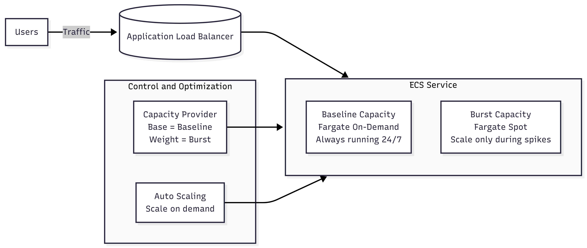

# ECS on Fargate: Baseline (On-Demand) + Burst (Fargate Spot)

This repository documents a reference architecture for running a web application on Amazon ECS with AWS Fargate that must be highly available (24/7) while remaining cost-effective during short-lived traffic bursts.

The core design principle is **capacity separation**:

- **Baseline capacity** runs on Fargate (On-Demand) to guarantee uptime.
- **Burst capacity** runs on Fargate Spot to reduce cost during traffic spikes.

---

## Design Goals

- **24/7 Availability (High Availability)**  
  Baseline tasks must remain stable and non-interruptible.

- **Elastic Scaling for Short Bursts**  
  The service must scale out quickly when traffic spikes and scale back in when traffic normalizes.

- **Cost Optimization**  
  Lower-cost capacity should be used only for temporary scaling, not for steady-state workloads.

---

## Architecture Overview

This architecture runs an ECS Service on AWS Fargate and separates workload capacity into two distinct layers:

- A **steady baseline layer** that is always running.
- A **dynamic burst layer** that scales only when needed.

This separation ensures availability requirements are met without overpaying for unused capacity.

---

## Components and Responsibilities

### 1. Application Load Balancer (ALB)

- **Public entry point** for all incoming HTTPS traffic.
- **Distributes requests** to healthy ECS tasks using IP-based target groups.
- **Improves resilience** by routing traffic away from unhealthy tasks.

---

### 2. ECS Service (Service Scheduler)

- **Maintains the desired task count** at all times.
- **Automatically replaces failed tasks** to preserve service continuity.
- **Integrates with Capacity Providers** to decide where tasks are launched.

---

### 3. Baseline Tasks — Fargate On-Demand

- **Always running** to handle steady-state traffic.
- **Non-interruptible capacity**, ensuring 24/7 availability.
- Forms the **reliability foundation** of the application.

---

### 4. Burst Tasks — Fargate Spot

- **Launched only during traffic spikes**.
- **Significantly cheaper** than On-Demand capacity.
- **Interruption-tolerant by design**, used exclusively for temporary scale-out.

---

### 5. CloudWatch and ECS Service Auto Scaling

- **CloudWatch monitors key metrics**, such as:
  - ALB request count per target
  - Target response time
  - ECS CPU and memory utilization
- **Auto Scaling policies** adjust the desired task count based on real-time demand.

---

### 6. Capacity Provider Strategy (Base + Weight)

- **Base**  
  Guarantees a minimum number of tasks always run on Fargate On-Demand (baseline).

- **Weight**  
  Directs additional tasks created during scale-out to Fargate Spot (burst).

- **Best practice**  
  This is the AWS-recommended way to combine Fargate and Fargate Spot in a managed and predictable manner.

---

## Request Flow

1. Users send HTTPS requests to the Application Load Balancer.
2. The ALB forwards requests to the ECS Service target group.
3. Baseline On-Demand tasks serve steady-state traffic.
4. When traffic increases, CloudWatch metrics trigger ECS Service Auto Scaling.
5. Auto Scaling increases the desired task count.
6. New tasks are placed on Fargate Spot according to the Capacity Provider strategy.
7. When traffic decreases, Auto Scaling scales in and terminates burst tasks first.

---

## Spot Interruption Behavior

Fargate Spot tasks may be interrupted by AWS when Spot capacity is reclaimed.

In this architecture:

- Only burst tasks use Spot capacity.
- Baseline tasks remain unaffected, preserving availability.
- ECS automatically attempts to restore the desired count based on the defined strategy.

This design limits the impact of Spot interruptions to non-critical capacity only.

---

## Why This Design Works

### High Availability

- Steady-state capacity runs on non-interruptible Fargate On-Demand.
- Tasks can be distributed across multiple Availability Zones.
- ECS Service continuously enforces the baseline desired count.

### Cost Optimization

- Short-lived traffic spikes use low-cost Fargate Spot.
- On-Demand capacity is not wasted on temporary demand.
- Costs automatically return to baseline levels after spikes subside.

---

## When to Use This Pattern

This architecture is ideal when:

- The application must be available 24/7.
- Traffic patterns include short, unpredictable bursts.
- Cost efficiency is important, but availability cannot be compromised.

---

## Summary

This architecture combines:

- Fargate On-Demand for stable, always-on baseline capacity  
- Fargate Spot for low-cost burst scaling  
- Capacity Providers using Base + Weight placement logic  
- CloudWatch and Auto Scaling for automatic elasticity  

The result is an always-available application with cost-optimized scalability.
