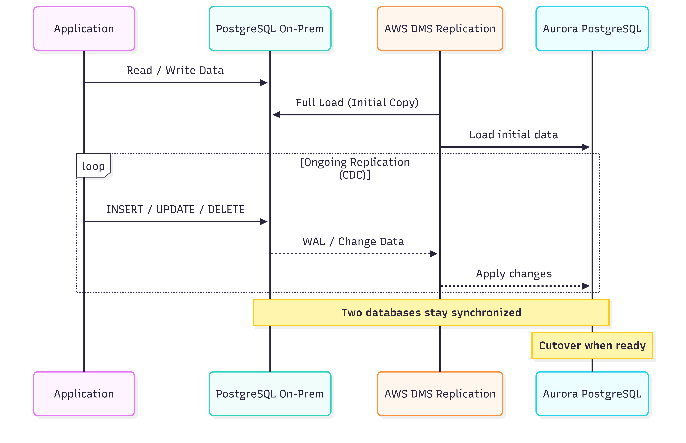

# 📦 On-Premises PostgreSQL to Amazon Aurora PostgreSQL Migration  
**Using AWS Database Migration Service (DMS) with Ongoing Replication**

---

## 1. 📌 Overview

This document describes the architecture and migration approach for moving an on-premises PostgreSQL database to Amazon Aurora PostgreSQL while ensuring:

- ✅ The on-premises database remains online and accessible  
- ✅ The Aurora database stays continuously synchronized  
- ✅ Zero or near-zero downtime during migration  

The solution leverages AWS Database Migration Service (AWS DMS) with ongoing replication (Change Data Capture – CDC).

---

## 2. 🎯 Business & Technical Requirements

### Business Requirements
- No service interruption for existing applications  
- Data consistency between source and target databases  
- Safe and controlled cutover  

### Technical Requirements
- Continuous data replication  
- Support for PostgreSQL → Aurora PostgreSQL (homogeneous migration)  
- Ability to capture ongoing changes (INSERT / UPDATE / DELETE)  

---

## 3. 🧱 High-Level Architecture

### Architecture Diagram

## 4. 🧩 Core Components

### 4.1 On-Premises PostgreSQL
- Acts as the source database
- Continues serving production traffic during migration
- Provides WAL (Write-Ahead Logs) for Change Data Capture (CDC)

---

### 4.2 AWS DMS Replication Instance (Answer C)
- Managed compute instance that runs DMS replication tasks
- Handles:
  - Source and target database connections
  - Initial full data load
  - Change Data Capture (CDC)
- Must be deployed in a VPC with network connectivity to both:
  - On-premises PostgreSQL
  - Amazon Aurora PostgreSQL

---

### 4.3 AWS DMS Ongoing Replication Task (Answer A)
- Migration type: Full load + ongoing replication
- Responsibilities:
  - Perform a one-time initial data copy
  - Continuously replicate ongoing data changes (CDC)
- Ensures the Aurora database stays synchronized until cutover

---

### 4.4 Amazon Aurora PostgreSQL
- Fully managed, PostgreSQL-compatible target database
- Receives:
  - Initial dataset from AWS DMS
  - Continuous updates via CDC
- Ready to become the production database at cutover

---

