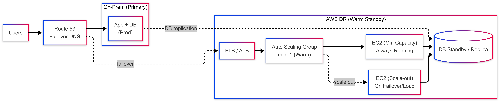

# Chiến lược Disaster Recovery (DR) Hybrid: Pilot Light vs Warm Standby

## 1. Pilot Light (Hybrid)
### Pilot Light Flow
 
### 1.1 Cách hoạt động
* **Trạng thái bình thường:** On-Prem: Chạy toàn bộ ứng dụng và Database (Prod), phục vụ người dùng 100%.
    * **AWS:** Chỉ duy trì các thành phần "lõi" (Pilot Light). Database replica hoặc standby luôn chạy để đồng bộ dữ liệu. Các tài nguyên Compute (EC2/EKS) ở trạng thái tắt hoặc số lượng cực nhỏ.
* **Khi xảy ra sự cố (Failover):**
    1.  **Database:** Promote DB ở AWS lên làm Primary.
    2.  **Compute:** Kích hoạt script tự động (IaC) để bật hoặc scale-out App Tier (từ gần như "0" lên đủ tải).
    3.  **Network:** Route 53 thực hiện failover chuyển traffic sang AWS.

### 1.2 Ưu điểm & Hạn chế
* **Lợi ích:** Chi phí duy trì cực thấp vì không tốn tiền cho Compute chạy không tải. Data luôn sẵn sàng, giảm thiểu rủi ro mất dữ liệu (RPO thấp).
* **Phù hợp:** Các hệ thống có ngân sách hạn chế và chấp nhận thời gian chờ (RTO) ở mức trung bình để đợi ứng dụng khởi động.

---

## 2. Warm Standby (Hybrid)
### Warm Standby Flow
 
### 2.1 Cách hoạt động
* **Trạng thái bình thường:** * On-Prem: Chạy Prod phục vụ người dùng.
    * **AWS:** Một bản "thu nhỏ" (scaled-down) của hệ thống luôn ở trạng thái Online. 
        * ALB/ELB đã sẵn sàng.
        * Auto Scaling Group (ASG) duy trì số lượng Instance tối thiểu (ví dụ `min=1`).
        * DB replica luôn đồng bộ và chạy.
* **Khi xảy ra sự cố (Failover):**
    1.  **Network:** Route 53 failover trỏ thẳng sang ALB ở AWS (traffic được xử lý ngay lập tức bởi các Instance đang chờ sẵn).
    2.  **Scale:** ASG nhận thấy tải tăng cao hoặc theo kịch bản failover sẽ scale-up nhanh chóng lên đủ công suất.
    3.  **Database:** Promote DB nếu cần thiết.

### 2.2 Ưu điểm & Hạn chế
* **Lợi ích:** RTO nhanh hơn đáng kể so với Pilot Light. Hệ thống ổn định và dễ dự đoán hơn vì hạ tầng AWS đã được kiểm tra (Health Check) liên tục.
* **Phù hợp:** Các hệ thống quan trọng, yêu cầu thời gian gián đoạn tối thiểu và chấp nhận chi phí duy trì Compute 24/7.

---

## So sánh Pilot Light vs Warm Standby

| Tiêu chí | Pilot Light | Warm Standby |
| :--- | :--- | :--- |
| **Trạng thái App Tier** | Tắt hoặc Rất nhỏ | Luôn chạy (Bản thu nhỏ) |
| **Chi phí (Cost)** | Thấp nhất | Trung bình |
| **Thời gian khôi phục (RTO)** | Trung bình (Vài chục phút) | Nhanh (Vài phút) |
| **Độ phức tạp khôi phục** | Cao (Cần automation/script tốt) | Thấp (Hệ thống đã chạy sẵn) |

---

